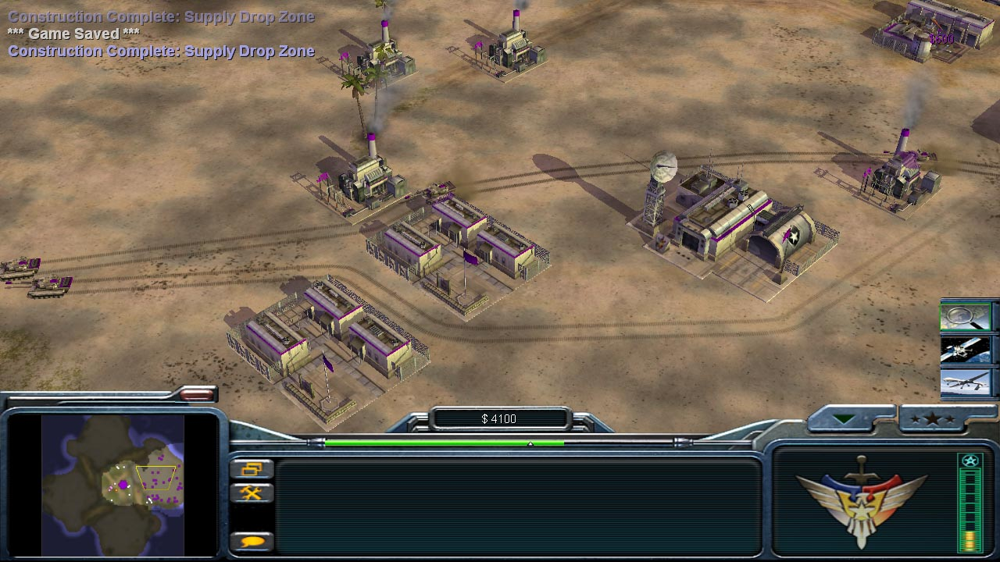

# Command and Conquer Generals graphics fix

Aim of this fix is to enable widescreen graphics and set proper camera height in game.

## What to do?

Modify/change both `.ini` files to match the provided examples:

`Options.ini` in 
`c:\Users\{username}\Documents\Command and Conquer Generals Zero Hour Data\Options.ini`

`GameData.ini` in
`...\Command and Conquer Generals Zero Hour\Data\INI\GameData.ini`\
`GameData.ini` file might not exist at first so you'll have to create it from scratch

## Before
Zoomed in 4:3 aspect ratio

  

  

## After
Zoomed out 16:9 widescreen aspect ratio

  

  

## Sources
[How to set widescreen resolution in Command & Comquer: Generals](https://gaming.stackexchange.com/questions/97255/how-can-i-set-a-widescreen-resolution)\
[How to increase the camera height in Command & Conquer: Generals](https://itectec.com/game/how-to-increase-the-camera-height-in-command-conquer-generals/)\
[CnC_Gen_Gamedata.zip](http://www.mediafire.com/file/p70aa54e7umb4f4/CnC_Gen_Gamedata.zip/file)